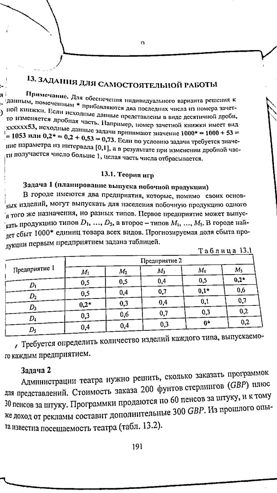

## 5x5 antagonistic game

The problem can be formalized as
$$V\to\max,$$
subject to
$$P^{\mathrm{T}} X \geq V,\ 1^{\mathrm{T}}X = 1,\ X\geq 0.$$

By moving $V$ from RHS to LHS
and introducing slack variables
this problem can be reduced to a linear program:

$$
\left\{
\begin{aligned}
&-V\to\min,\\
&
\left(
\begin{array}{c|c|c}
\begin{matrix}
-1 \\ \vdots \\ -1
\end{matrix}
&
\begin{matrix}
-1 & & 0 \\
   & \ddots & \\
0  & & -1
\end{matrix} &
P^{\mathrm{T}} \\ \hline
\begin{matrix}
0
\end{matrix}
&
\begin{matrix}
0 & \cdots & 0
\end{matrix}
&
\begin{matrix}
1 & \cdots & 1
\end{matrix}
\end{array}
\right)
\begin{pmatrix}
V\\
s_1\\
\vdots\\
s_n\\
x_1\\
\vdots\\
x_n
\end{pmatrix}
=
\begin{pmatrix}
0\\
\vdots\\
0\\ \hline
1
\end{pmatrix}
,\\
& V, s, X \geq 0.
\end{aligned}
\right.$$

Octave solution:
```octave
[m, n] = size(P);
A = [-ones(n,1), -eye(n), P'; zeros(1,n+1), ones(1,m)];
b = [zeros(n,1);1];
c = [1; zeros(size(A,2)-1,1)];
X = glpk(-c,A,b);
V = c'*X;
```

The result is:
```octave
>> P =
   0.500000   0.500000   0.400000   0.500000   0.201000
   0.500000   0.400000   0.700000   0.101000   0.600000
   0.201000   0.300000   0.400000   0.100000   0.700000
   0.300000   0.600000   0.700000   0.300000   0.200000
   0.400000   0.400000   0.300000   0.010000   0.200000

>> X'
ans =

   0.66741   0.00000   0.33259   0.00000   0.00000

>> V =  0.36696
```


